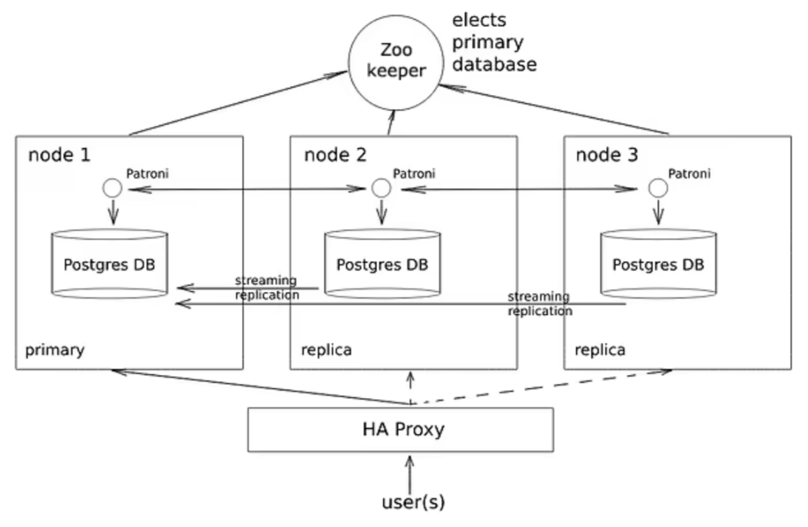
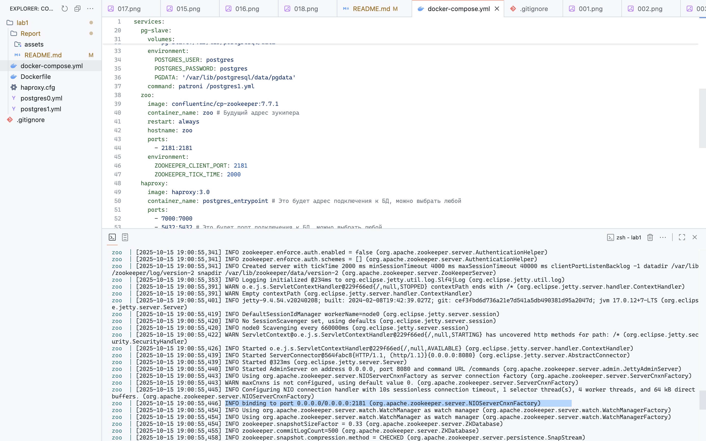

# Отчёт по ЛР1

## Тема

HA (High Availability) Postgres Cluster

## Задача

Развернуть и настроить высокодоступный кластер Postgres.

Примерная схема работы требуемого кластера (только в рамках данной работы будем реализовывать не три ноды, а две - master и slave):



Работу будем выполнять на локальном устройстве.

## Часть 1. Поднимаем Postgres

### №1

Подготовим `Dockerfile` для запуска Postgres. Кластеризацию будем делать с помощью Patroni, которому нужен доступ к бинарным файлам самого Postgres, поэтому собираем образ, который содержит в себе и Postgres, и Patroni.

Dockerfile
```
FROM postgres:15

# Ставим нужные для Patroni зависимости
RUN apt-get update -y && \
    apt-get install -y netcat-openbsd python3-pip curl python3-psycopg2 python3-venv iputils-ping

# Используем виртуальное окружение, доустанавливаем, собственно, Patroni
RUN python3 -m venv /opt/patroni-venv && \
    /opt/patroni-venv/bin/pip install --upgrade pip && \
    /opt/patroni-venv/bin/pip install patroni[zookeeper] psycopg2-binary

# Копируем конфигурацию для двух узлов кластера Patroni
COPY postgres0.yml /postgres0.yml
COPY postgres1.yml /postgres1.yml

ENV PATH="/opt/patroni-venv/bin:$PATH"
```

### №2

Подготовим compose-файл, с помощью которого объединим две Postgres-ноды в единый кластер. Также добавим в compose-файл Zookepeer, который будет отвечать за непосредственно репликацию и определение “лидера” кластера.

docker-compose.yml
```yaml
services:
  pg-master:
    build: .
    user: postgres
    image: localhost/postres:patroni # имя для кастомного образа из Dockerfile, можно задать любое
    container_name: pg-master # Будущий адрес первой ноды
    restart: always
    hostname: pg-master
    environment:
      POSTGRES_USER: postgres
      POSTGRES_PASSWORD: postgres
      PGDATA: '/var/lib/postgresql/data/pgdata'
    expose:
      - 8008
    ports:
      - 5433:5432
    volumes:
      - pg-master:/var/lib/postgresql/data
    command: patroni /postgres0.yml

  pg-slave:
    user: postgres
    build: .
    image: localhost/postres:patroni # имя для кастомного образа из Dockerfile, можно задать любое
    container_name: pg-slave # Будущий адрес второй ноды
    restart: always
    hostname: pg-slave
    expose:
      - 8008
    ports:
      - 5434:5432
    volumes:
      - pg-slave:/var/lib/postgresql/data
    environment:
      POSTGRES_USER: postgres
      POSTGRES_PASSWORD: postgres
      PGDATA: '/var/lib/postgresql/data/pgdata'
    command: patroni /postgres1.yml

  zoo:
    image: confluentinc/cp-zookeeper:7.7.1
    container_name: zoo # Будущий адрес зукипера
    restart: always
    hostname: zoo
    ports:
      - 2181:2181
    environment:
      ZOOKEEPER_CLIENT_PORT: 2181
      ZOOKEEPER_TICK_TIME: 2000

volumes:
  pg-master:
  pg-slave:
```

### Вопрос

Порты 8008 и 5432 вынесены в разные директивы, expose и ports. По сути, если записать 8008 в ports, то он тоже станет exposed. В чём разница?

### Ответ

Директивы expose и ports выполняют разные функции:

- expose документирует порты, по которым общаются только узлы внутри Docker-сети (в целом, узлы в процессе работы кластера могут общаться и через другие порты, в том числе и порты из директивы ports, но директива expose задаёт именно “официальные“ порты для внутрисетевого общения между узлами, например, между pg-master и pg-slave). Эти порты недоступны для доступа из внешней сети, а потому для них указано лишь внутрисетевое значение `8008`.
- ports в свою очередь задаёт “общие“ порты, которые открыты как для внутрисетевого подключения между узлами, так и для подключения из внешней сети (именно по этим портам мы будем в дальнейшем подключаться к БД для записи и чтения данных через клиент), то есть ports также являются и expose (в то время как expose не являются ports). Так как ports доступны и из внешней сети, то мы используем механизм переадресации с внешнего порта (`5433` для pg-master и `5434` для pg-slave) на внутренний порт Docker-сети (`5432` для обоих узлов) и обратно.

В целом, в рамках кластера можно полностью убрать expose, так как узлы могут общаться и через ports, но с точки зрения грамотной структуры крайне желательно разделять функционал и ответственность по директивам expose и ports:

- В expose указывать порты, по которым общаются узлы кластера внутри Docker-сети.
- В ports указывать порты для внешнего подключения к узлам кластера.

Подобная структура считается более понятной и удобной для работы с кластером (например, для отладки или масштабирования).

### №3

Создадим файлы `postgres0.yml` и `postgres1.yml`, которые будут задавать конфигурацию для PostgreSQL-узлов `pg-master` и `pg-slave` соответственно. Структура этих двух файлов схожа, различаются лишь имя, адрес и место хранения данных ноды.

postgres0.yml
```yaml
scope: my_cluster # Имя кластера
name: postgresql0 # Имя первой ноды

restapi: # REST API для первой ноды
  listen: pg-master:8008
  connect_address: pg-master:8008

zookeeper:
  hosts:
    - zoo:2181 # Адрес Zookeeper

bootstrap:
  dcs:
    ttl: 30
    loop_wait: 10
    retry_timeout: 10
    maximum_lag_on_failover: 10485760
    master_start_timeout: 300
    synchronous_mode: true
  postgresql:
    use_pg_rewind: true
    use_slots: true
    parameters:
      wal_level: replica
      hot_standby: "on"
      wal_keep_segments: 8
      max_wal_senders: 10
      max_replication_slots: 10
      wal_log_hints: "on"
      archive_mode: "always"
      archive_timeout: 1800s
      archive_command: mkdir -p /tmp/wal_archive && test ! -f /tmp/wal_archive/%f && cp %p /tmp/wal_archive/%f
  pg_hba:
    - host replication replicator 0.0.0.0/0 md5
    - host all all 0.0.0.0/0 md5

postgresql:
  listen: 0.0.0.0:5432
  connect_address: pg-master:5432 # Адрес первой ноды
  data_dir: /var/lib/postgresql/data/postgresql0 # Директория с данными первой ноды
  bin_dir: /usr/lib/postgresql/15/bin
  pgpass: /tmp/pgpass0
  authentication:
    replication:
      username: replicator
      password: rep-pass
    superuser:
      username: postgres
      password: postgres
  parameters:
    unix_socket_directories: '.'

watchdog:
  mode: off

tags:
  nofailover: false
  noloadbalance: false
  clonefrom: false
  nosync: false
```

postgres1.yml
```yaml
scope: my_cluster # Имя нашего кластера
name: postgresql1 # Имя второй ноды

restapi: # Адреса второй ноды
  listen: pg-slave:8008
  connect_address: pg-slave:8008

zookeeper:
  hosts:
    - zoo:2181 # Адрес Zookeeper

bootstrap:
  dcs:
    ttl: 30
    loop_wait: 10
    retry_timeout: 10
    maximum_lag_on_failover: 10485760
    master_start_timeout: 300
    synchronous_mode: true
  postgresql:
    use_pg_rewind: true
    use_slots: true
    parameters:
      wal_level: replica
      hot_standby: "on"
      wal_keep_segments: 8
      max_wal_senders: 10
      max_replication_slots: 10
      wal_log_hints: "on"
      archive_mode: "always"
      archive_timeout: 1800s
      archive_command: mkdir -p /tmp/wal_archive && test ! -f /tmp/wal_archive/%f && cp %p /tmp/wal_archive/%f
  pg_hba:
    - host replication replicator 0.0.0.0/0 md5
    - host all all 0.0.0.0/0 md5

postgresql:
  listen: 0.0.0.0:5432
  connect_address: pg-slave:5432 # Адрес второй ноды
  data_dir: /var/lib/postgresql/data/postgresql1 # Место хранения данных второй ноды
  bin_dir: /usr/lib/postgresql/15/bin
  pgpass: /tmp/pgpass1
  authentication:
    replication:
      username: replicator
      password: rep-pass
    superuser:
      username: postgres
      password: postgres
  parameters:
    unix_socket_directories: '.'

watchdog:
  mode: off

tags:
  nofailover: false
  noloadbalance: false
  clonefrom: false
  nosync: false
```

### №4

Развернём кластер и проверим в логах, что ZooKeeper запустился и что одна PostgeSQL-нода стала “лидером“.




По логам запуска двух узлов кластера можно заметить следующее:

- `pg-master` (`postgres0`) стал лидером кластера. Видим это по следующему сообщению:

```
I am (postgresql0), the leader with the lock
```

- `pg-slave` (`postgres1`) стал репликой кластера, которая следует за лидером. Видим это по следующему сообщению:

```
I am (postgresql1), a secondary, and following a leader (postgresql0)
```

### Вопрос

При обычном перезапуске композ-проекта, будет ли сбилден заново образ? А если предварительно отредактировать файлы `postgresX.yml`? А если содержимое самого `Dockerfile`? Почему?

### Ответ

Рассмотрим три сценария перезапуска проекта (перезапуск можно выполнить с помощью команд `docker-compose restart` или `docker-compose down` + `docker-compose up`)

1. Простой перезапуск проекта без изменения файлов.
2. Перезапуск проекта с предварительно отредактированными `postgres0.yml` и (или) `postgres1.yml`.
3. Перезапуск проекта с предварительно отредактированным `Dockerfile`.

Рассмотрим каждый из этих сценариев:

#### Сценарий 1

В первую очередь стоит отметить, что в рамках Docker существуют две концепции:

- Образ (Images) - это шаблон, неизменяемый слепок, собранный из инструкций в `Dockerfile` и связанных с ним файлов.
- Контейнер (Containers) - это работающий экземпляр образа.

Команды `docker-compose restart` и `docker-compose down` + `docker-compose up` работают в первую очередь с контейнерами. При перезапуске проекта Docker Compose проверяет, существует ли уже собранный ранее образ и если `Dockerfile` не был изменён, то создаёт контейнер на основе уже готового образа, не создавая нового.

Таким образом, в случае простого перезапуска проекта без изменения файлов, новый образ собираться не будет.

> Стоит отметить, что при перезапуске с помощью команд `docker-compose down` + `docker-compose up --build` (добавлен флаг `--build`) образ будет пересобран принудительно даже если существует уже готовый образ и `Dockerfile` не был изменён.

#### Сценарий 2

При перезапуске проекта с предварительно отредактированными `postgres0.yml` и (или) `postgres1.yml`, Docker Compose увидит наличие уже собранного ранее образа, не найдёт изменений в `Dockerfile` и потому также перезапустит проект (на базе старых версий `postgres0.yml` и `postgres1.yml`) без сборки нового образа, несмотря на то, что `postgres0.yml` и `postgres1.yml` напрямую указаны в `Dockerfile`:

Dockerfile
```
# ...
# Копируем конфигурацию для двух узлов кластера Patroni
COPY postgres0.yml /postgres0.yml
COPY postgres1.yml /postgres1.yml
# ...
```

В данному случае нужно учитывать особенность работы Docker Compose, при которой он при перезапуске проверяет только `Dockerfile`, но не связанные с ним файлы (это сделано для повышения скорости работы), а значит если `Dockerfile` не был изменён, то образ не будет прособираться даже при изменении связанных файлов.

> Для того, чтобы образ был пересобран согласно изменениям в `postgres0.yml` и (или) `postgres1.yml`, нужно использовать флаг `--build`: `docker-compose down` + `docker-compose up --build`.

#### Сценарий 3

Соответственно, как уже было сказано выше, при перезапуске проекта с предварительно отредактированным `Dockerfile`, Docker Compose создаст новый образ, который и будет использоваться для запуска контейнеров.

#### Вывод

- Сценарий 1: Образ не будет пересобран. Запуск контейнера произойдёт на основе уже существующего образа.
- Сценарий 2: Образ не будет пересобран. Запуск контейнера произойдёт на основе уже существующего образа, использующего старые версии `postgres0.yml` и `postgres1.yml`.
- Сценарий 3: Образ будет пересобран в соответствии с новой версией `Dockerfile`.

## Часть 2. Проверяем репликацию

Возьмём PostgreSQL-клиент psql и подключимся к обеим нодам PostgreSQL.

Из двух подключений выберем `pg-master` и через него создадим таблицу и запишем в неё данные:


Теперь перейдём к подключению `pg-slave` и проверим, что во второй БД создалась такая же таблица с теми же данными. Также убедимся, что мы не можем изменить данные, хранящиеся в БД, через `pg-slave`, так как оно является репликой и даёт возможность лишь просматривать данные, но не изменять их.


## Часть 3. Делаем высокую доступность

Для балансировки трафика между двумя нодами воспользуемся HAProxy, добавив его в `docker-compose.yml`:

docker-compose.yml
```yaml
# ...
haproxy:
  image: haproxy:3.0
  container_name: postgres_entrypoint # Это будет адрес подключения к БД, можно выбрать любой
  ports:
    - 7000:7000   
    - 5432:5432 # Это будет порт подключения к БД, можно выбрать любой
  depends_on: # Не забываем убедиться, что сначала все корректно поднялось
    - pg-master
    - pg-slave
    - zoo
  volumes:
  - ./haproxy.cfg:/usr/local/etc/haproxy/haproxy.cfg:ro
# ...
```

Для конфигурации HAProxy создадим файл `haproxy.cfg`:

haproxy.cfg
```
global
    maxconn 100

defaults
    log global
    mode tcp
    retries 3
    timeout client 30m
    timeout connect 4s
    timeout server 30m
    timeout check 5s

listen stats
    mode http
    bind *:7000
    stats enable
    stats uri /

listen postgres
    bind *:5432
    option tcp-check
    default-server inter 3s fall 3 rise 2 on-marked-down shutdown-sessions
    server pg_master pg-master:5432 check port 8008
    server pg_slave pg-slave:5432 check port 8008
```

Перезапустим проект и проверим, что HAProxy успешно заработал:


## Задание

### Описание задания

Любым способом выключаем доступ до ноды, которая сейчас является мастером (например, через `docker stop`). Некоторое время ждём, после этого анализируем логи и так же пытаемся считать/записать что-то в БД через entrypoint подключение.  Затем необходимо расписать, получилось или нет, а так же объяснить, что в итоге произошло после принудительного выключения мастера (со скриншотами).

### Выполнение задания

Выключим доступ до ноды `pg-master` с помощью команды `docker stop`:


После этого пробуем занести в БД-кластер новые данные через entrypoint-подключение, созданное с помощью HAProxy. У нас нету psql, поэтому создаем временный контейнер, подсоединяем к сети и подключаемся к хосту entrypoint:

```
docker run -it --rm --network computer-networks-labs_default postgres:17-alpine psql -h postgres_entrypoint -p 5432 -U postgres -d postgres
```

Подключение успешно потому, что по умолчанию трафик редиректится на мастер-ноду, а мастер теперь pg-slave. И как следствие, при изменении данных ошибки не будет.


Снова запускаем `pg-master`:


Видим, что `postgres0` (`pg-master`) снова стал лидером кластера:


Также проверяем, что данные, загруженные при выключенном `pg-master`, снова доступны через `pg-master`, что говорит об успешной синхронизации данных между узлами БД-кластера:


### Объяснение

В рамках данного задания были продемонстрированы два свойства созданного нами БД-кластера:

- При выключение узла `pg-master`, который являлся лидером кластера, БД-кластер всё-равно продолжает свою работу за счёт того, что лидером кластера становится второй узел `pg-slave` (который до этого выступал в роли реплики), который занимает место `pg-master` в рамках entrypoint-подключение, благодаря чему пользователь может обращаться к БД-кластеру по тому же адресу что и раньше.
- При повторном подключении `pg-master` вновь становится лидером кластера и получает все те изменения, которые были записаны в БД в его отсутствие. Это происходит благодаря тому, что в настройках обоих PostgreSQL-узлов указаны соответствующие параметры в разделе `bootstrap`, которые и реализуют функционал синхронизации:

postgres0.yml; postgres1.yml
```yaml
bootstrap:
  dcs:
    ttl: 30
    loop_wait: 10
    retry_timeout: 10
    maximum_lag_on_failover: 10485760
    master_start_timeout: 300
    synchronous_mode: true
  postgresql:
    use_pg_rewind: true
    use_slots: true
    parameters:
      wal_level: replica
      hot_standby: "on"
      wal_keep_segments: 8
      max_wal_senders: 10
      max_replication_slots: 10
      wal_log_hints: "on"
      archive_mode: "always"
      archive_timeout: 1800s
      archive_command: mkdir -p /tmp/wal_archive && test ! -f /tmp/wal_archive/%f && cp %p /tmp/wal_archive/%f
  pg_hba:
    - host replication replicator 0.0.0.0/0 md5
    - host all all 0.0.0.0/0 md5
```
