# Лабораторная работа 2: Мониторинг и визуализация с Nextcloud, Loki, Promtail, Grafana и Zabbix

## Часть 1: Развертывание инфраструктуры

### 1. Создание docker-compose.yml

Создать файл `docker-compose.yml`, который содержит в себе тестовый сервис Nextcloud, Loki, Promtail, Grafana, Zabbix и Postgres для него.

### 2. Создание конфигурации Promtail

Создать файл `promtail_config.yml` (или любое другое имя, главное чтобы совпадало с прописанным в compose) со следующим содержанием:

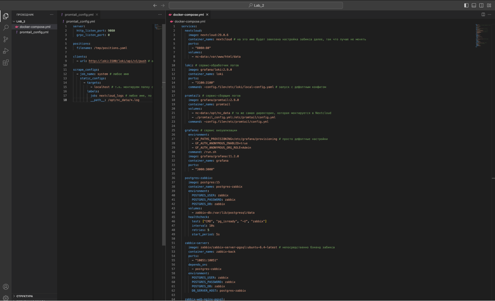

### 3. Запуск сервисов

Запустить compose файл, проверить что все сервисы успешно запустились:

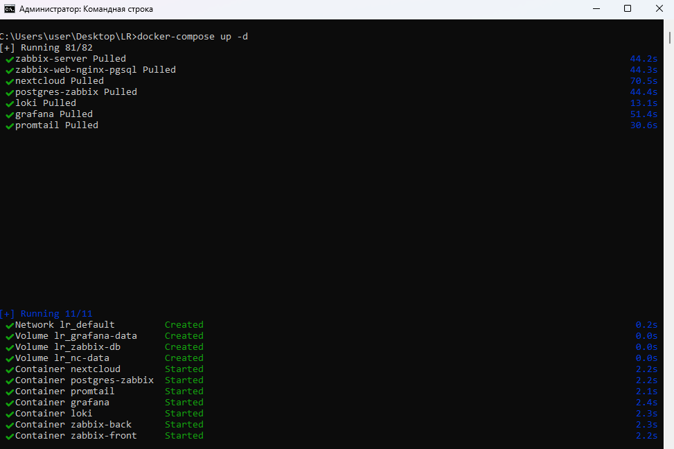

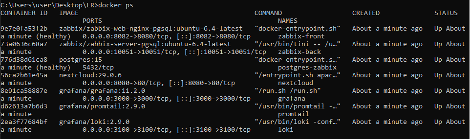

### 4. Инициализация Nextcloud

Для начала инициализируем Nextcloud. Для этого заходим на веб-интерфейс через внешний порт, указанный в compose файле, создаем учетную запись и проверяем, что логи записываются в файл `/var/www/html/data/nextcloud.log`:

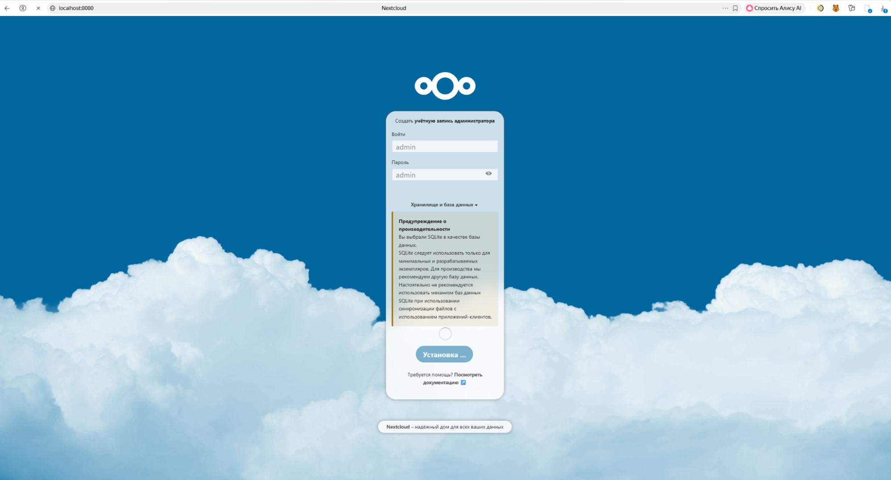

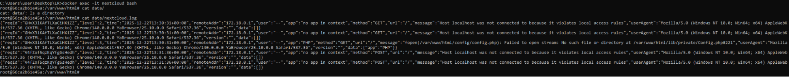

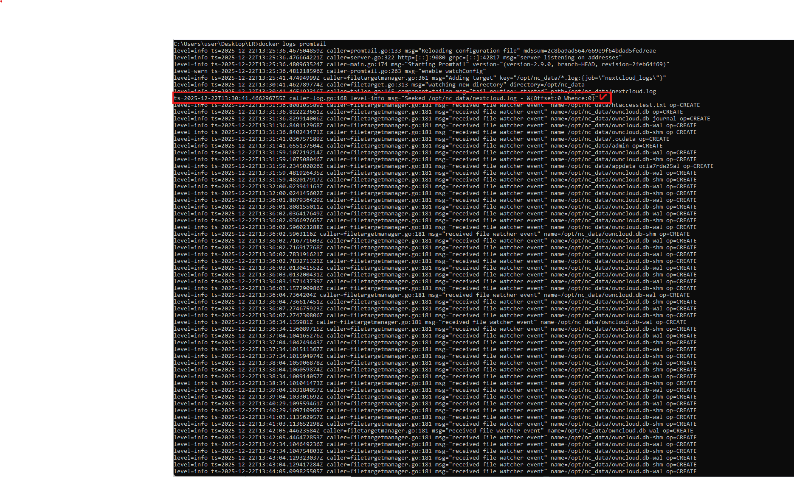

## Часть 2: Настройка мониторинга

### 1. Подключение к Zabbix

Подключаемся к веб-интерфейсу Zabbix (по умолчанию `http://localhost:8082` или другой выбранный порт из compose файла). Учетные данные по умолчанию: `Admin` | `zabbix`.

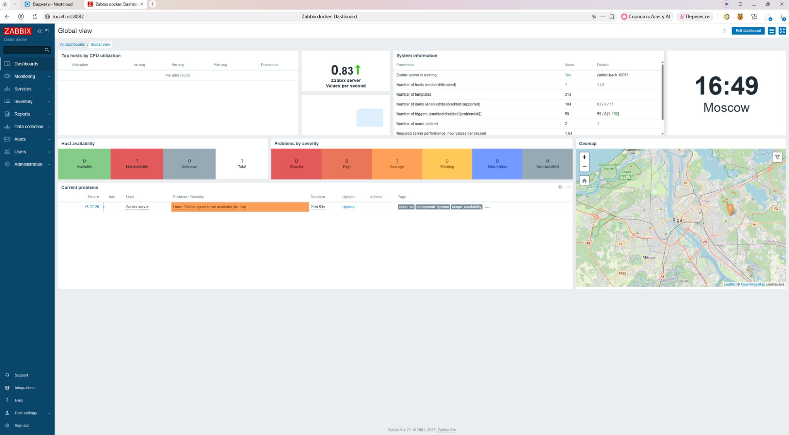

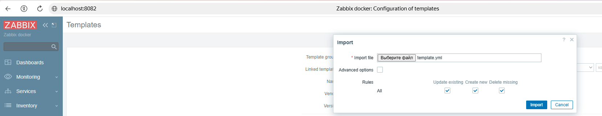

### 2. Создание шаблона мониторинга

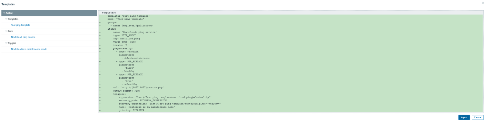

### 3. Настройка trusted domains в Nextcloud

Чтобы Zabbix и Nextcloud могли взаимодействовать по коротким именам внутри Docker-сети, необходимо добавить имя в список доверенных доменов Nextcloud. Для этого нужно зайти в контейнер Nextcloud под пользователем `www-data` и выполнить команду:

```bash
php occ config:system:set trusted_domains 1 --value="nextcloud"
```

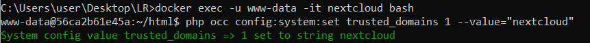

### 4. Создание хоста для мониторинга

В разделе **Data collection → Hosts** создать новый хост (Create host). Указать адрес (имя) контейнера `nextcloud`, видимое имя — любое, группа хостов — Applications (можно выбрать любую другую).

Чтобы начать мониторинг, необходимо подключить к хосту шаблон мониторинга. В поле **Templates** выбрать добавленный на шаге 2 шаблон: Templates/Applications → Test ping template.

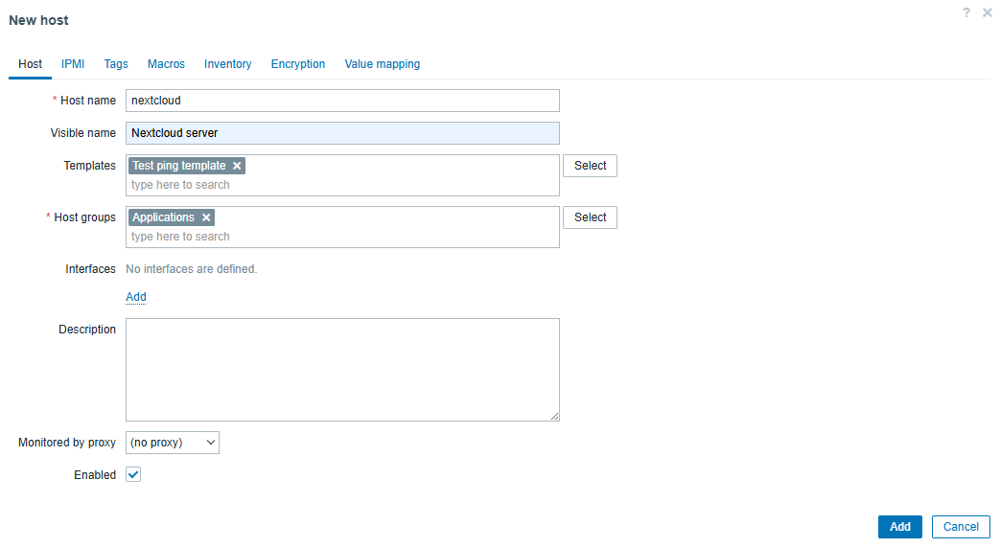

Настройка хоста завершена. Сохранить настройки и перейти в раздел **Monitoring → Latest data**. Через некоторое время должны появиться первые данные, в нашем случае значение `healthy`:

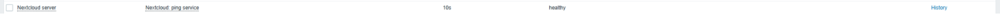

### 5. Проверка триггеров

На этом мониторинг можно считать успешно настроенным. При желании можно временно включить в Nextcloud режим обслуживания (maintenance mode), выполнив команду в контейнере:

```bash
php occ maintenance:mode --on
```

Проверить, что сработал триггер в разделе **Monitoring → Problems**, затем выключить режим обратно:

```bash
php occ maintenance:mode --off
```

Убедиться, что проблема помечена как "решенная".

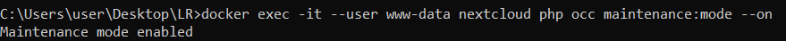

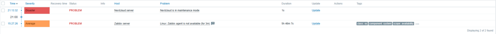

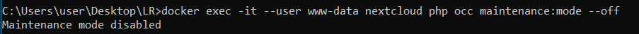


## Часть 3: Визуализация

### 1. Установка плагина Zabbix в Grafana

В терминале выполнить команду:

```bash
docker exec -it grafana bash -c "grafana cli plugins install alexanderzobnin-zabbix-app"
```

Затем перезапустить контейнер:

```bash
docker restart grafana
```

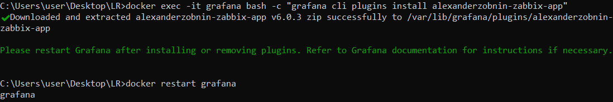

### 2. Активация плагина Zabbix

Заходим в Grafana (по умолчанию `http://localhost:3000/`), раздел **Administration → Plugins**. Найти там Zabbix и активировать (Enable).

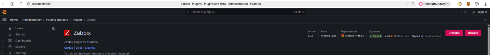

### 3. Подключение Loki к Grafana

Подключаем Loki к Grafana в разделе **Connections → Data sources → Loki**. В настройках подключения указать любое имя и адрес `http://loki:3100`, все остальное можно оставить по умолчанию:


Сохранить подключение, нажав **Save & Test**. Если нет ошибок и сервис предлагает перейти к визуализации и/или просмотру данных, значит в Части 1 все настроено правильно.

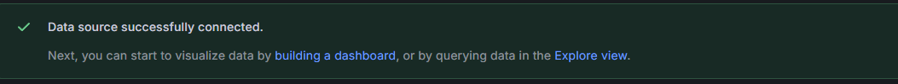

### 4. Подключение Zabbix к Grafana

Точно так же с Zabbix: снова подключаем новый датасурс, в этот раз Zabbix. В качестве URL указываем `http://zabbix-front:8080/api_jsonrpc.php`, заполняем Username и Password, через **Save & Test** проверяем, что подключение успешно.

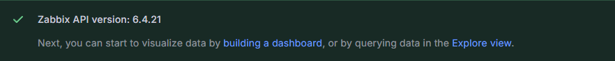

### 5. Использование Explore для просмотра логов

Можно перейти в **Explore** (на этой же странице или через общее меню), выбрать в качестве селектора (индекса) `job` либо `filename`. Если все было правильно настроено, то нужные значения будут в выпадающем списке. Затем нажать **Run query** и увидеть свои логи.

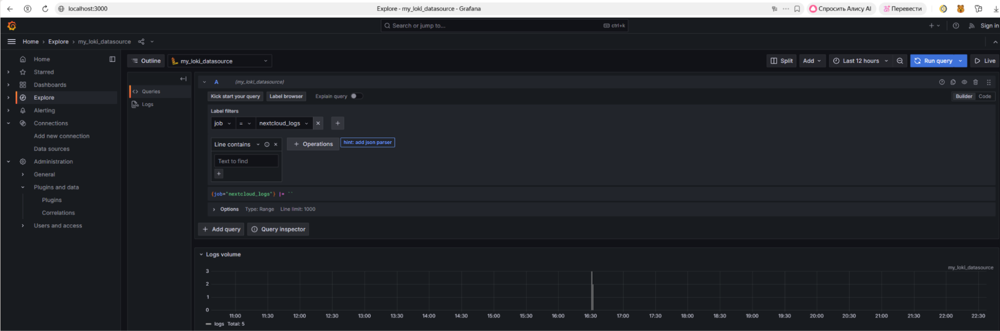

### 6. Просмотр данных Zabbix в Explore

То же самое с Zabbix, при выставлении всех фильтров:

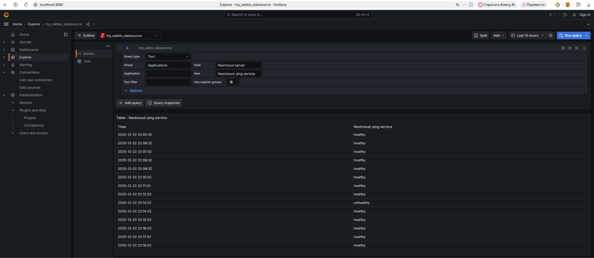

### 7. Работа с запросами

Используем запрос `{job="nextcloud_logs"} |= "level\":3"`, чтобы отобразить только те записи, которые имеют уровень ошибок 3:

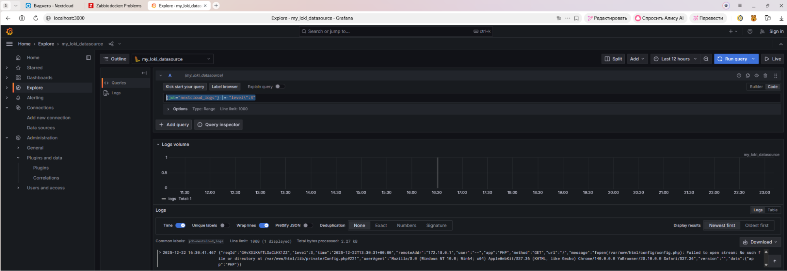

### 8. Создание дашбордов в Grafana

Создать два дашборда в Grafana с использованием датасурсов Zabbix (цветная плашка) и Loki (таблица с логами).

#### Дашборд Zabbix

Дашборд отображает healthy/unhealthy состояния сервера:

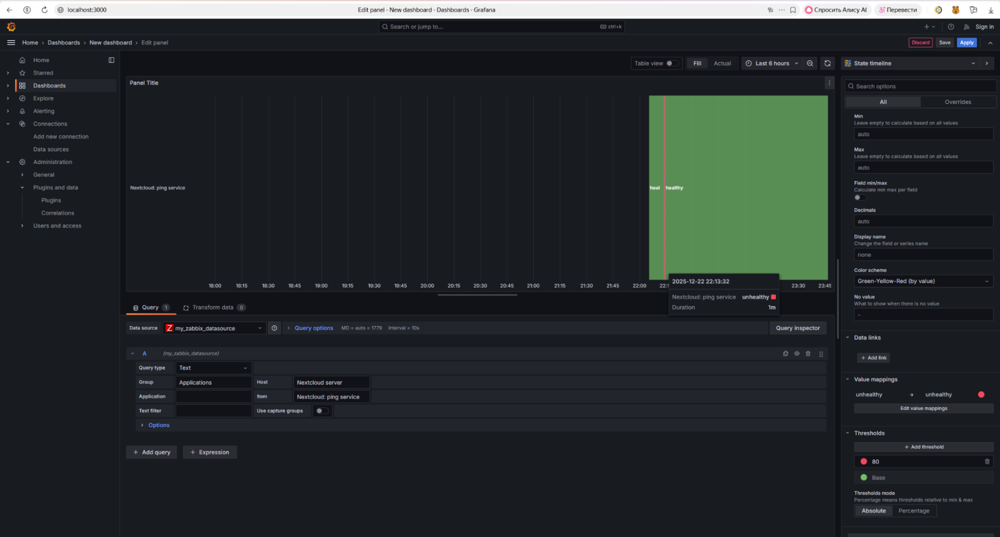

#### Дашборд Loki

Для Loki таблица с логами:

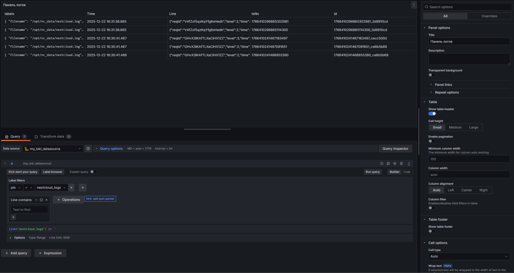

## Вопросы

### 1. Чем SLO отличается от SLA?

Эти две метрики часто путают, хотя они служат разным целям в управлении качеством сервиса.

**SLA (Service Level Agreement)** представляет собой контрактное обязательство перед конечным пользователем. Это документ, который фиксирует минимально допустимые показатели работы системы. Например, провайдер облачных услуг может гарантировать, что его сервис будет доступен 99.9% времени в месяц. Если эти показатели не достигаются, клиент получает компенсацию — обычно в виде скидок или возврата средств.

**SLO (Service Level Objective)** — это внутренний критерий качества, который команда разработки использует для самоконтроля. Команды намеренно устанавливают SLO на более высоком уровне, чем внешний SLA. Например, если в договоре с клиентом прописана доступность 99.9%, команда может поставить себе цель в 99.95%. Этот запас в 0.05% служит "подушкой безопасности".

**Практическое применение:**
- SLA используется в договорах с клиентами и влечет юридические последствия
- SLO применяется для внутреннего планирования и приоритизации технических задач
- Нарушение SLO сигнализирует команде о необходимости действий до того, как пострадают клиенты и будет нарушен SLA

### 2. Чем отличается инкрементальный бэкап от дифференциального?

Обе стратегии резервного копирования призваны сократить время и дисковое пространство по сравнению с полным бэкапом, но делают это по-разному.

**Инкрементный подход** работает по принципу "копируем только новые изменения". Каждая последующая копия содержит лишь файлы, которые изменились после предыдущего резервного копирования (любого типа). Представим ситуацию: в воскресенье сделан полный бэкап, в понедельник — инкрементный (копируются изменения с воскресенья), во вторник — инкрементный (копируются изменения с понедельника). При таком подходе каждый бэкап занимает минимум места, но чтобы восстановить систему на вторник, потребуется применить полный бэкап и оба инкрементных по порядку.

**Дифференциальный подход** использует стратегию "копируем все изменения с последнего полного бэкапа". В той же ситуации: полный бэкап в воскресенье, дифференциальный в понедельник (изменения с воскресенья), дифференциальный во вторник (все изменения с воскресенья, включая понедельничные). С каждым днем размер дифференциального бэкапа растет, но восстановление упрощается — нужны только два файла: полный бэкап и последний дифференциальный.

**Выбор стратегии зависит от приоритетов:**
- Если критично экономить место на хранилище — используйте инкрементный
- Если важна скорость восстановления и простота — выбирайте дифференциальный
- Для длительного хранения инкрементный выгоднее, для оперативного восстановления — дифференциальный

### 3. В чем разница между мониторингом и observability?

Эти понятия тесно связаны, но представляют разные уровни контроля над системой.

**Мониторинг** можно сравнить с медицинской диспансеризацией — мы регулярно проверяем заранее определенные показатели здоровья системы. Настраиваются алерты на критические метрики: загрузка процессора превысила 80%, частота ошибок 500 выросла, свободное место на диске заканчивается. Это эффективный инструмент для обнаружения проблем, о которых мы знаем заранее. Например, если настроен алерт на превышение нагрузки, мы получим уведомление, когда это случится.

**Observability (наблюдаемость)** — это способность системы "рассказать" о своем внутреннем состоянии через внешние данные. Это похоже на возможность проводить детальное расследование: не просто знать, что произошла ошибка, а понять весь путь запроса через систему. В данной лабораторной работе мы использовали Loki для гибкого поиска по логам — это элемент observability. Мы можем задать вопрос "покажи все логи с ошибками уровня 3 за последний час" без предварительной настройки такого запроса.

**Как это проявилось в работе:**
- **Zabbix** — инструмент мониторинга: мы настроили проверку статуса Nextcloud и получили алерт при переходе в maintenance mode
- **Loki + Grafana Explore** — инструменты observability: позволяют произвольно искать и анализировать логи без предварительной настройки конкретных метрик
- Мониторинг отвечает на вопрос "что сломалось?", observability помогает понять "почему это произошло?"

## Выводы

В ходе выполнения лабораторной работы был успешно развернут и настроен полнофункциональный стек observability на базе открытого программного обеспечения.

Реализованы следующие компоненты:
- **Централизованный сбор логов:** настроен Promtail для сбора логов приложения Nextcloud и их передачи в Loki
- **Мониторинг доступности:** реализован мониторинг состояния сервиса Nextcloud с помощью Zabbix, включая настройку триггеров для уведомления о проблемах (например, при переходе в режим обслуживания)
- **Единая платформа визуализации:** все источники данных (логи из Loki и метрики из Zabbix) интегрированы в Grafana, что обеспечивает централизованный доступ к информации о состоянии системы

Практическая работа продемонстрировала:
- Преимущества контейнеризации для быстрого развертывания сложных инфраструктурных решений
- Важность интеграции различных инструментов мониторинга для получения полной картины состояния системы
- Эффективность использования открытых решений (Loki, Grafana, Zabbix) для построения production-ready систем наблюдаемости

Полученные навыки применимы для построения систем мониторинга и observability в реальных проектах, обеспечивая проактивное выявление проблем и быструю диагностику инцидентов.
