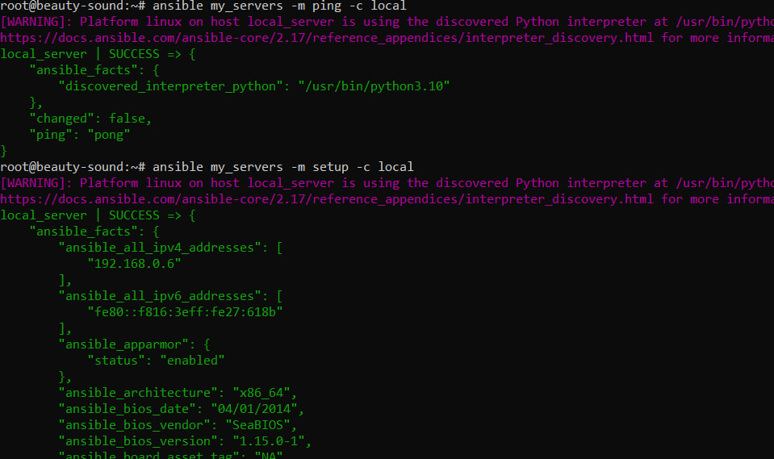
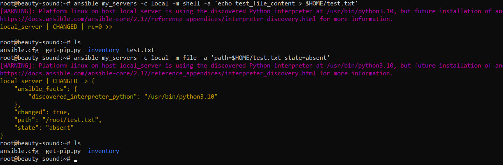
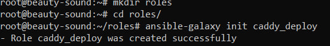
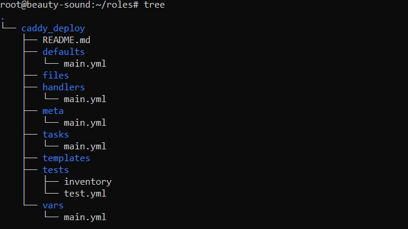
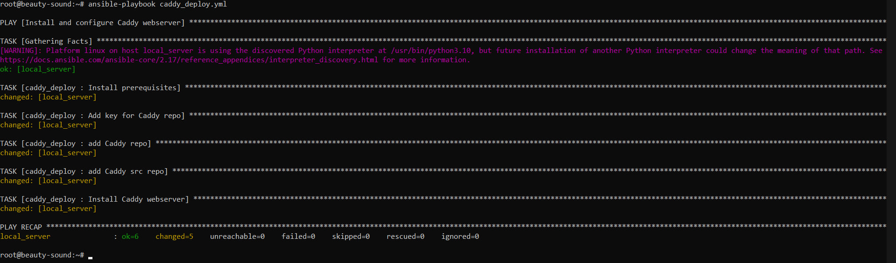
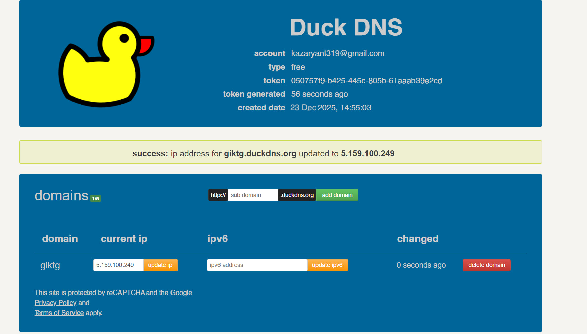
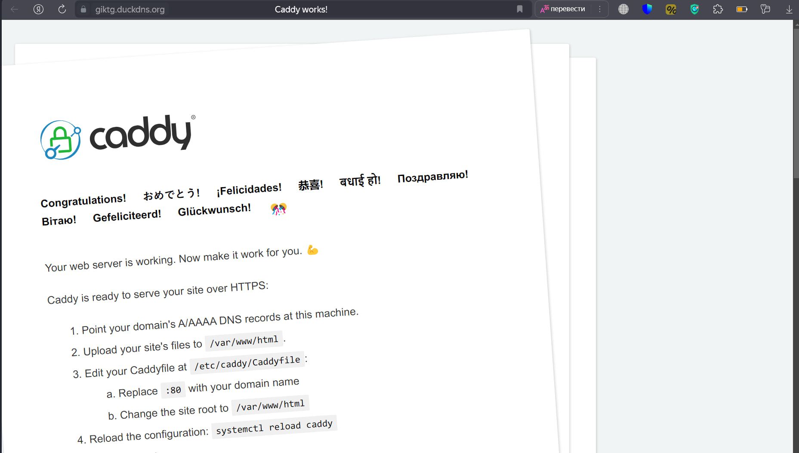
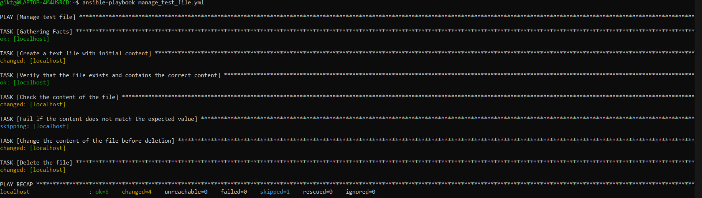

# Лабораторная работа №3

1. Устанавливаем все пакеты и проверяем, что сервер с Ansible подключился к “клиенту”

2. Пробуем выполнить команду с созданием и удалением файлов на нашем клиенте

3. Устанавливаем Caddy_deploy

4. Запускаем playbook: ansible-playbook caddy_deploy.yml и проверяем, успешно ли все шаги выполнились

5. Регистрируем себе бесплатный домен на ip-адрес ВМ на сервисе duckdns.org

6. Запускаем обновленный playbook

7. Видим, тестовая страничка Caddy автоматически поднялась

## Задания:
### 1. Переписать пример с созданием и удалением файла из шага 5 Части 1 с ad-hoc команд на playbook формат, а так же добавить четвертый шаг - перед удалением поменять содержимое файла на любое другое.

[Ссылка на обновленный playbook](manage_test_file.yml)

Пример работы playbookа

### 2. Cделать всю работу на удаленном сервере, а не на одном и том же localhost

Работа сделана на удаленном сервере